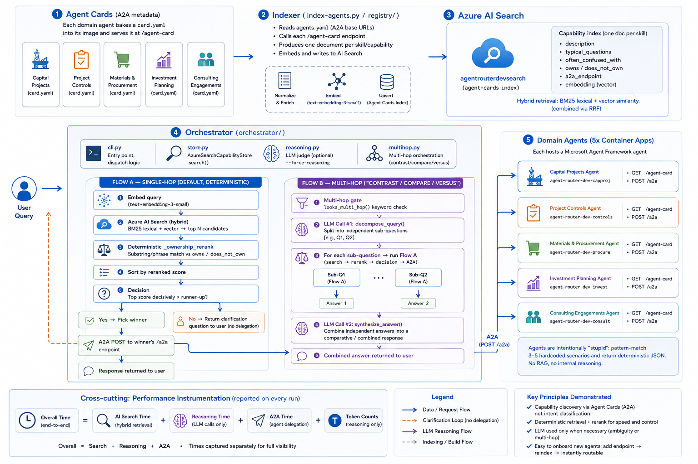

# Architecture

Technical handover describing how the system works in enough detail to draw a diagram.

## Purpose

Demonstrate that **capability discovery and delegation** — not the domain agents
themselves — is the interesting AI problem in multi-agent systems. Five domain agents
deliberately share vocabulary ("project", "cost", "forecast") so routing is genuinely
ambiguous, forcing a real disambiguation mechanism rather than a trivial keyword match.

## Components

**1. Agent Cards (`agents/*/card.yaml`)**
Each of 5 domain agents (Capital Projects, Project Controls, Materials & Procurement,
Investment Planning, Consulting Engagements) has a YAML card with: `name`, `description`,
`skills`, `owns` (vocabulary it's authoritative on), `does_not_own` (explicit boundaries
against confusable neighbors), `examples` (typical questions). This is the authoritative,
protocol-level (A2A) metadata baked into each agent's Docker image.

**2. Indexer (`index-agents.py` / `registry/`)**
Reads `agents.yaml` (list of A2A base URLs), calls each agent's live `/agent-card`
endpoint, and produces **one searchable document per agent skill/capability** (not one
giant doc per agent) — e.g., "project-controls / cost-performance-analysis". Each
document embeds: description, typical_questions, often_confused_with, a2a_endpoint, plus
a text-embedding-3-small vector. Writes to Azure AI Search index `agent-cards`.

**3. Azure AI Search (`agentrouterdevsearch`)**
Stores the capability index. Supports **hybrid retrieval**: BM25 lexical + vector
similarity, combined via RRF. This is the only retrieval mechanism used — no agentic
retrieval, keeping mechanics visible (one query → ranked list → orchestrator decides).

**4. Orchestrator (`orchestrator/`)** — the core of the diagram
- `cli.py` — entry point, dispatch logic
- `store.py` — `AzureSearchCapabilityStore.search()`: queries AI Search (hybrid), fetches
  `top*4` candidates, applies `_ownership_rerank` (deterministic substring/phrase match
  against each card's `owns`/`does_not_own`), re-sorts by reranked score, returns ranked
  candidates
- `reasoning.py` — optional LLM judge (GPT-5.4-nano via Azure OpenAI) used only with
  `--force-reasoning`, or automatically when the deterministic rerank is inconclusive
- `multihop.py` — the genuinely agentic path: `looks_multi_hop()` (keyword gate:
  contrast/compare/versus) → `decompose_query()` (LLM splits into independent
  single-fact sub-questions) → per-sub-question route+delegate (reuses steps above) →
  `synthesize_answer()` (LLM combines the independent answers)

**5. Domain Agents** (5x Azure Container Apps,
`agent-router-dev-{capproj,controls,procure,invest,consult}`)
Each hosts a tiny Microsoft Agent Framework agent exposing:
- `/agent-card` (GET) — serves its static card.yaml as JSON (A2A Agent Card)
- `/a2a` (POST) — A2A 1.0 endpoint; receives a question, deterministically pattern-matches
  against 3-5 hardcoded scenarios, returns JSON. No RAG, no real reasoning inside —
  intentionally "stupid."

## Two request flows

### Flow A — Single-hop (default, deterministic)

```
User query
  -> Orchestrator: embed query (text-embedding-3-small)
  -> Azure AI Search: hybrid search (lexical+vector) -> top N capability docs
  -> Orchestrator: _ownership_rerank (deterministic substring match vs owns/does_not_own)
  -> sort by reranked score
  -> if top score decisively beats runner-up -> pick winner
  -> else -> return clarification question to user (no delegation)
  -> A2A POST to winner's /a2a endpoint
  -> Response returned to user
```

No LLM call in the happy path — retrieval + rule-based rerank only.

### Flow B — Multi-hop ("contrast X with Y")

```
User query
  -> looks_multi_hop() keyword gate trips
  -> LLM call #1: decompose_query() -> [sub-question 1, sub-question 2]
  -> for each sub-question, independently run Flow A (search -> rerank -> A2A)
     (can land on two different agents)
  -> LLM call #2: synthesize_answer() combines both independent answers
  -> Combined comparative answer returned to user
```

This is the only path that truly requires LLM reasoning end-to-end (splitting compound
intent, and combining cross-agent facts) — everything else is deterministic plumbing.

## Cross-cutting: performance instrumentation

Every run tracks and reports: Overall time, AI Search time, Reasoning time (LLM calls
only), A2A time, and token counts (reasoning only) — these are timed separately so
overall time = sum of the three phases, visible in every CLI trace
(`try-orchestrator.ps1`).

## Diagram



## Diagram shape (ASCII fallback)

```
Agent Cards (5x YAML)
     |  index-agents.py
     v
Azure AI Search (hybrid: lexical+vector) - "agent-cards" index
     ^                                          |
     |  query embedding                         |  ranked candidates
     |                                          v
User --> Orchestrator --(deterministic rerank)--+
              |                                 |
              |  (if ambiguous & multi-hop keyword)
              v
        LLM: decompose -> [sub-Q1, sub-Q2] --> (recurse Flow A per sub-Q)
              |
              v
        LLM: synthesize combined answer
              |
              v
        A2A POST --> 5x Container Apps (agent-card + /a2a) --> deterministic JSON reply
```

## Related docs

- [`docs/multihop-example-run.md`](multihop-example-run.md) — verbatim example run of Flow B
- [`docs/demos.md`](demos.md) — demo scenarios and commands
- [`docs/infra-deployment.md`](infra-deployment.md) — deployment and cleanup
- [`docs/performance.md`](performance.md) — performance repro and headline numbers
- [`docs/perf-journal.md`](perf-journal.md) — full experiment log
